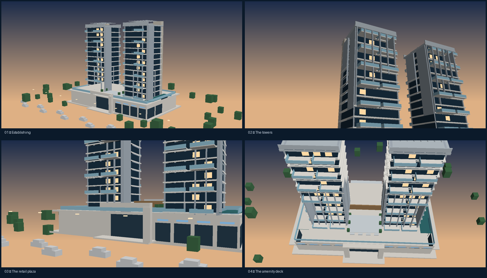

# Alpine Landmarks LLP

Marketing site for Alpine Landmarks LLP (Pimpri-Chinchwad, Pune), built with Vite,
React, TypeScript and Tailwind.

The differentiator is the **Alpine Astonia digital twin**: a real-time, procedurally
modelled version of the project that visitors scroll through on the landing page and
explore freely on `/projects/alpine-astonia/experience`.

## Routes

| Route | Page |
| --- | --- |
| `/` | Landing page — scroll-driven 3D stage + editorial sections |
| `/projects` | Filterable portfolio index |
| `/projects/:slug` | Project detail (overview, amenities, plans, videos, map, enquiry) |
| `/projects/alpine-astonia/experience` | Full digital twin — orbit, hotspots, floor selector, time of day |
| `*` | Branded 404 |

## The 3D system

Everything lives in `src/components/three/astonia/`:

- `geometry.ts` — pure data. Boxes describing the two towers, the retail podium, the
  amenity deck and the site. No three.js imports, so it is cheap to test and to reuse.
- `AstoniaModel.tsx` — turns each list into one instanced draw call.
- `Atmosphere.tsx` — sky dome, sun rig, fog and a procedural reflection probe
  (`<Environment>` + `<Lightformer>`, so no HDR file is ever downloaded).
- `time.ts` — dawn / day / dusk / night presets. Every value is damped, never snapped.
- `CinematicRig.tsx` — maps landing-page scroll progress onto camera keyframes.
- `twin.tsx` — orbit controls, hotspots and the floor highlight for the experience page.
- `AstoniaCanvas.tsx` — the single `<Canvas>` wrapper (tone mapping, bloom, vignette, SMAA).

### Principles

- **Never block the site on WebGL.** `useQuality()` probes the device after first paint
  and returns `high` / `low` / `off`. `off` keeps the photographic hero and every page
  stays fully usable.
- **Keep three.js out of the initial bundle.** The canvas (and therefore three,
  drei and postprocessing) is behind `React.lazy`, which is why the scroll rig is
  passed into `AstoniaCanvas` as a prop instead of being imported by the page.
- **Instances over meshes.** ~450 boxes render as a dozen draw calls.
- **Damping over animation.** Camera, lights, fog and bloom all ease toward a target
  in `useFrame`, so scroll and state changes read as cinematography.

### Previewing the model without a browser

`scripts/preview_model.py` rasterises the same geometry with a flat shader so massing
and camera framing can be checked from a terminal:

```bash
npx esbuild src/components/three/astonia/geometry.ts --format=cjs --outfile=/tmp/geom.cjs
node -e "const g=require('/tmp/geom.cjs');require('fs').writeFileSync('/tmp/astonia.json',JSON.stringify({meta:{},data:g.buildAstonia()}))"
python3 scripts/preview_model.py         # writes /tmp/preview-act*.png
```

`scripts/model-preview.png` is the output of that tool for the four landing-page
camera acts (flat-shaded, so it under-sells the real materials and lighting):



### Swapping in a real GLB

When a final architectural model exists, drop a Draco-compressed `.glb` into
`src/assets/models/`, load it with drei's `useGLTF` inside `AstoniaModel`, and keep the
existing `Atmosphere`, rig and fallbacks. Aim for under ~2 MB.

## Environment

Copy `.env.example` to `.env` to enable the Supabase-backed enquiry form:

```
VITE_SUPABASE_URL=
VITE_SUPABASE_PUBLISHABLE_KEY=
```

Without it the site still works — the enquiry form validates and then hands the lead to
WhatsApp instead of dropping it.

## Scripts

```bash
npm run dev     # dev server on :8080
npm run build   # production build
npm run lint    # eslint
npm test        # vitest (routes + 3D model)
```
